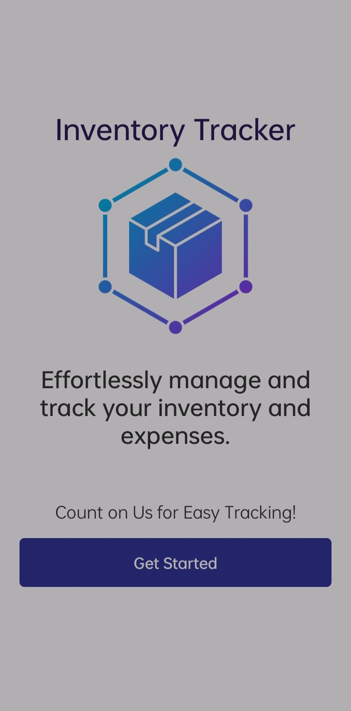
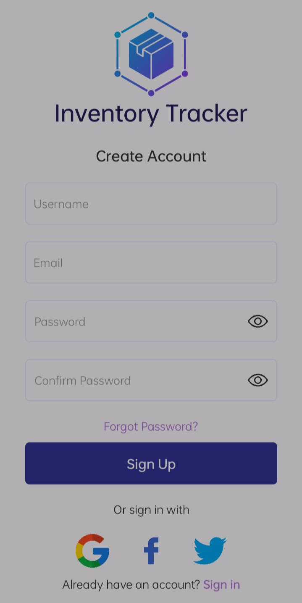
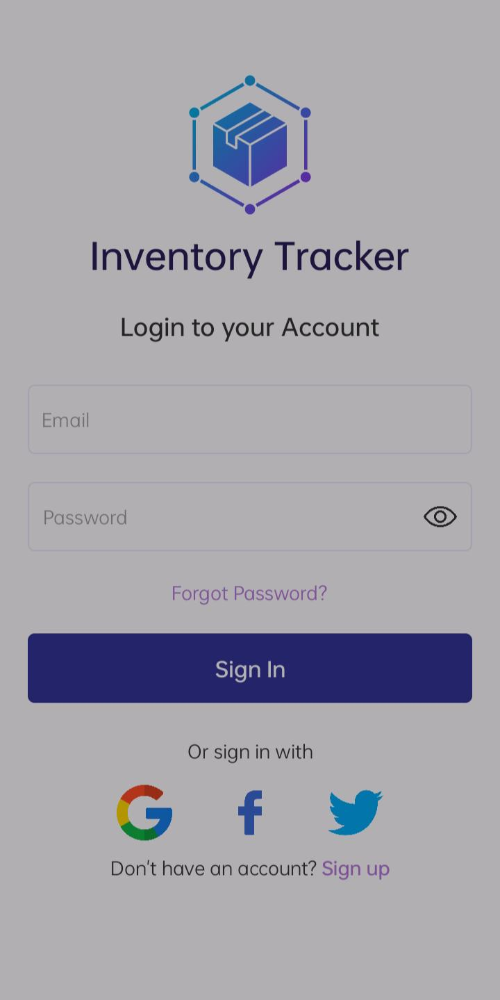
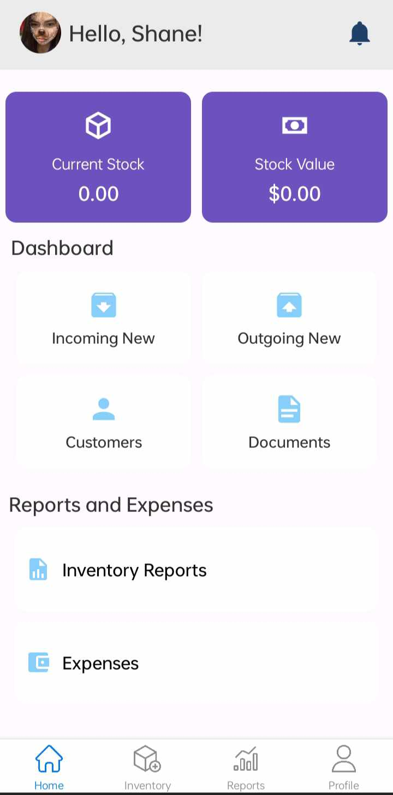
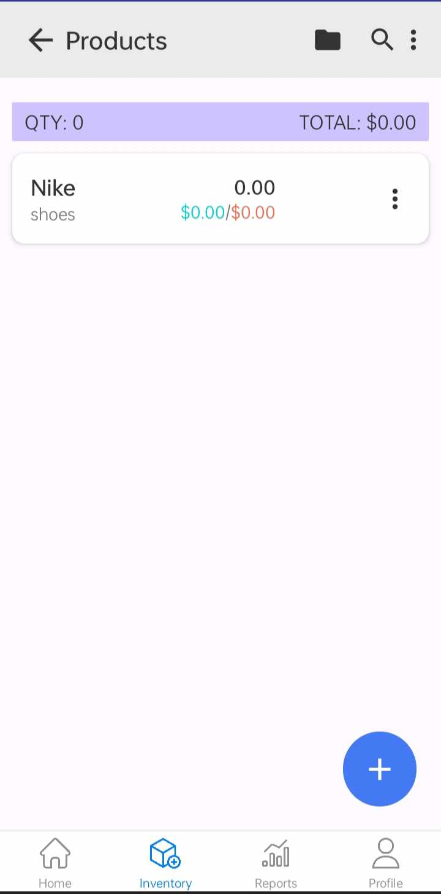
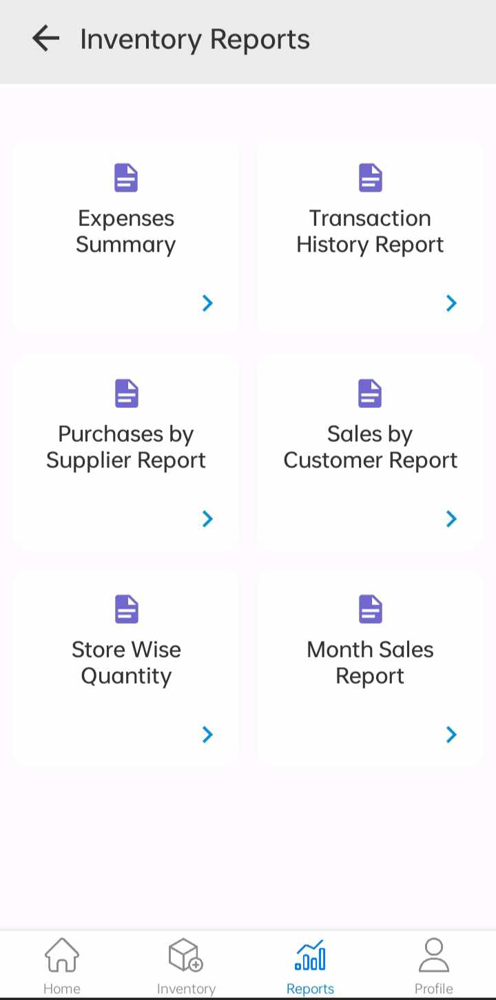

# Inventory Tracker
  Inventory Mobile App

# Features
* Easily add, update, or remove products from the inventory.
* Receive notifications when stock levels are low.
* Enables users to export inventory data, sales, and expense reports to Excel or   PDF for easier analysis.
* Allows users to log and track sales transactions, providing insights into product performance.

# Course Overview
* Basic React Native Components
* Database Design using Appwrite
* User Registration & Authenticaiton
* Deployment

# Tech Stack
* React Native
* AppWrite
* HTML, CSS and JS

# Home Screen
  

# Sign Up Screen
  

# Sign In Screen
  

# Tabs Screen

# Home Screen

# Inventory Screen

# Report

# Profile

# Screen Demo 
